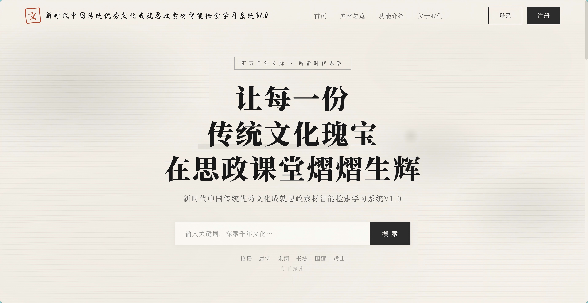
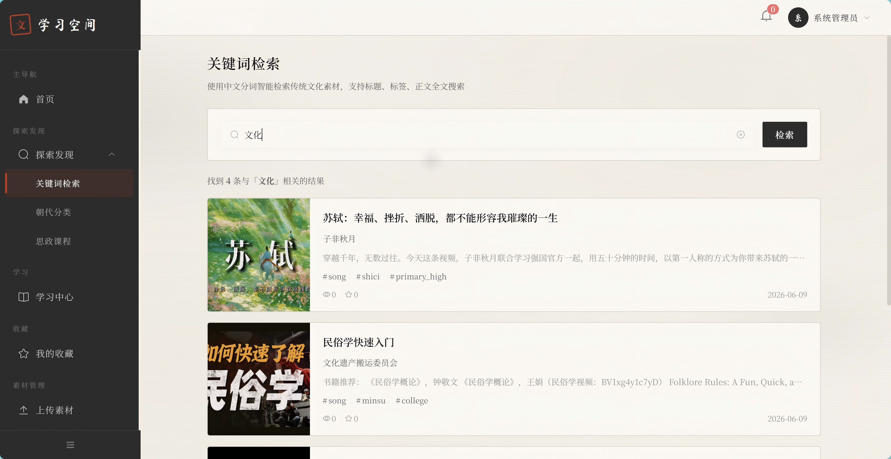
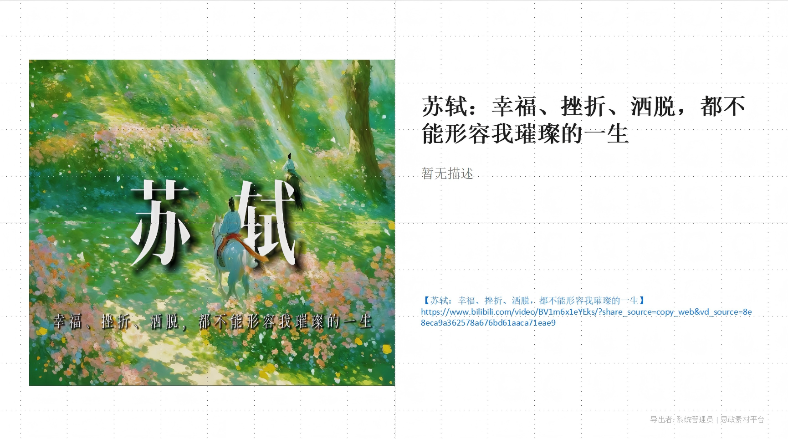
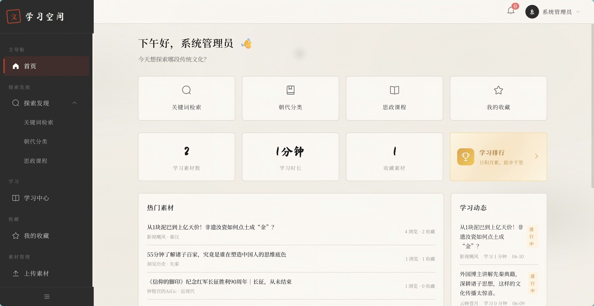
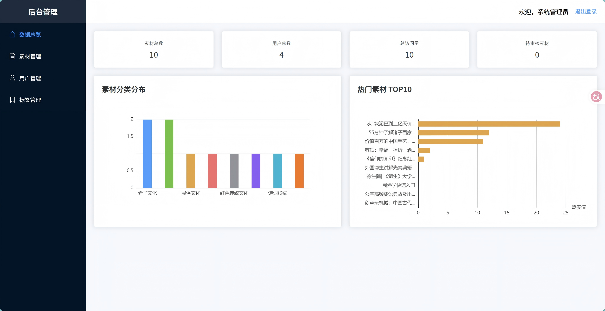

# 新时代中国传统优秀文化成就思政素材智能检索学习系统 V1.0 🏆 里程碑版本

> **汇五千年文脉，铸新时代思政。** —— 让每一份传统文化瑰宝，都能在思政课堂上熠熠生辉。

基于 Spring Boot + Vue 3 的思政教学素材智能管理与学习平台，支持素材上传、智能检索、在线学习、课件导出等功能。

---

## 系统截图

| 英雄页 |
|:---:|
|  |

| 关键词检索 | PPT导出 |
|:---:|:---:|
|  |  |

| 个人空间 | 后台仪表盘 |
|:---:|:---:|
|  |  |

---

## 里程碑版本说明

**V1.0 里程碑版本** — 经过 11 次迭代，系统已完整覆盖**学生端、教师端、管理后台**三大业务场景，核心功能闭环全部打通。

### 里程碑交付清单

| 模块 | 核心功能 | 状态 |
|------|---------|:----:|
| **学生端** | 国风首页、素材浏览/检索/收藏、学习记录追踪 | ✅ |
| **教师端** | 素材上传（图文/视频/批量 Word+PDF 解析）、编辑/删除、课件导出（Word/PPT）、附件打包下载 | ✅ |
| **管理后台** | 数据仪表盘（分类彩色图表）、素材审核、用户管理（含重置密码）、标签管理、分类字典 | ✅ |
| **智能检索** | 结巴分词全文检索 + 高亮、搜索建议、热门搜索词 | ✅ |
| **权限体系** | 三角色（学生/教师/管理员）+ JWT 认证 + 新用户默认禁用 | ✅ |
| **设计系统** | 水墨国风主题 + 过渡动画 + Element Plus 组件库 | ✅ |

### 技术指标

- **后端**：14 个 REST 控制器、48 个 API 端点、98 个 Java 源文件
- **数据库**：11 张数据表，雪花 ID + BCrypt 密码 + 全文索引
- **前端**：学生/教师端 + 管理后台双前端应用
- **文档解析**：Apache POI（Word）+ PDFBox（PDF）自动提取标题与正文
- **课件导出**：Apache POI 生成 Word 课件、Apache POI 生成 PPT 课件
- **附件下载**：单文件流式下载 + 多附件 ZIP 打包下载

## 技术栈


## 项目结构

```
szxx/
├── init.sql                    # 数据库初始化脚本（11 张表 + 种子数据）
├── szxx-server/                # Spring Boot 后端（98 个 Java 源文件）
│   ├── pom.xml
│   └── src/
│       ├── main/java/com/szxx/
│       │   ├── common/         # 统一响应、全局异常、配置
│       │   ├── security/       # JWT 认证、权限控制
│       │   ├── entity/         # 11 个实体类
│       │   ├── handler/        # MyBatis-Plus 自动填充处理器
│       │   ├── mapper/         # 11 个 MyBatis-Plus Mapper
│       │   ├── dto/            # 23 个请求/响应 DTO
│       │   ├── service/        # 11 个业务服务接口 + 10 个实现
│       │   ├── controller/     # 14 个 REST 控制器
│       │   └── util/           # 4 个工具类
│       └── test/               # 5 个单元测试类
├── szxx-client-web/            # 学生/教师端 Vue 3 前端
│   └── src/
│       ├── api/                # Axios 封装 + API 接口
│       ├── router/             # 路由配置 + 鉴权守卫
│       ├── stores/             # Pinia 用户状态
│       └── views/              # 页面组件
└── szxx-admin-web/             # 管理后台 Vue 3 前端
    └── src/（同上结构）
```

## 快速开始

### 环境要求

- JDK 17+
- MySQL 8.0+
- Maven 3.8+
- Node.js 18+

### 1. 初始化数据库

```bash
mysql -uroot -p < init.sql
```

默认数据库名 `szxx_system`，端口 3307。可在 `application-dev.yml` 中修改。

### 2. 启动后端

**方式一：Maven 插件运行（开发推荐）**

```bash
cd szxx-server
mvn spring-boot:run
```

**方式二：打包运行**

```bash
cd szxx-server
mvn clean package -DskipTests
java -jar target/szxx-server-1.0.0.jar --spring.profiles.active=dev
```

服务运行在 `http://localhost:8089`。

### 3. 启动前端

```bash
# 学生/教师端（端口 5173）
cd szxx-client-web
npm install
npm run dev

# 管理后台（端口 5174）
cd szxx-admin-web
npm install
npm run dev
```

### 4. 创建上传目录

```bash
mkdir D:/szxx-storage
```

## API 概览（48 个端点）

### 公开接口
| 方法 | 路径 | 说明 |
|------|------|------|
| POST | `/api/v1/auth/register` | 用户注册 |
| POST | `/api/v1/auth/login` | 用户登录 |
| POST | `/api/v1/auth/logout` | 用户登出 |
| GET | `/api/v1/categories` | 获取全部分类（朝代/品类/学段） |
| GET | `/api/v1/tags` | 获取全部标签 |

### 用户接口（需认证）
| 方法 | 路径 | 说明 |
|------|------|------|
| GET | `/api/v1/user/profile` | 获取个人信息 |
| PUT | `/api/v1/user/profile` | 修改个人信息 |
| PUT | `/api/v1/user/password` | 修改密码 |

### 素材接口
| 方法 | 路径 | 说明 | 权限 |
|------|------|------|------|
| GET | `/api/v1/materials` | 分页浏览（支持朝代/品类/学段/关键词/排序筛选） | 认证 |
| GET | `/api/v1/materials/my` | 我的素材（教师查看自己上传的素材） | 教师/管理员 |
| GET | `/api/v1/materials/filter` | 素材筛选（按类别/朝代/学段/标签组合过滤） | 认证 |
| GET | `/api/v1/materials/{id}` | 查看素材详情 | 认证 |
| POST | `/api/v1/materials` | 创建素材（含标签绑定、封面上传、附件上传） | 教师/管理员 |
| PUT | `/api/v1/materials/{id}` | 编辑素材 | 教师/管理员 |
| DELETE | `/api/v1/materials/{id}` | 删除素材 | 教师/管理员 |
| POST | `/api/v1/materials/parse-video` | 视频解析（提取视频时长/分辨率等信息） | 教师/管理员 |
| POST | `/api/v1/materials/batch-upload` | 批量上传 Word/PDF（自动解析标题+正文） | 教师/管理员 |

### 智能检索
| 方法 | 路径 | 说明 |
|------|------|------|
| GET | `/api/v1/search?keyword=` | 全文检索（结巴分词 + 高亮） |
| GET | `/api/v1/search/suggest` | 搜索建议 |
| GET | `/api/v1/search/hot` | 热门搜索词 |

### 收藏
| 方法 | 路径 | 说明 |
|------|------|------|
| POST | `/api/v1/favorites/toggle/{id}` | 收藏/取消收藏 |
| GET | `/api/v1/favorites/check/{id}` | 检查是否已收藏 |
| GET | `/api/v1/favorites` | 我的收藏列表 |
| DELETE | `/api/v1/favorites/batch` | 批量取消收藏 |

### 学习记录
| 方法 | 路径 | 说明 |
|------|------|------|
| POST | `/api/v1/learning/report` | 上报学习进度 |
| GET | `/api/v1/learning/records` | 学习记录列表（仅展示已审核素材） |
| GET | `/api/v1/learning/stats` | 学习统计 |
| GET | `/api/v1/learning/ranking` | 学习排行榜 |

### 文件
| 方法 | 路径 | 说明 |
|------|------|------|
| POST | `/api/v1/files/upload/image` | 上传图片 |
| POST | `/api/v1/files/upload/avatar` | 上传头像 |
| GET | `/api/v1/files/download/{id}` | 下载单个附件 |
| GET | `/api/v1/files/download-all/{id}` | 打包下载素材全部附件（ZIP） |

### 课件导出
| 方法 | 路径 | 说明 | 权限 |
|------|------|------|------|
| POST | `/api/v1/export/word` | 导出素材为 Word 课件 | 教师/管理员 |
| POST | `/api/v1/export/ppt` | 导出素材为 PPT 课件 | 教师/管理员 |

### 管理后台（需管理员权限）
| 方法 | 路径 | 说明 |
|------|------|------|
| GET | `/api/v1/admin/dashboard` | 数据仪表盘 |
| GET | `/api/v1/admin/stats/materials-by-category` | 素材分类统计（彩色图表） |
| GET | `/api/v1/admin/stats/top-materials` | 热门素材排行 |
| GET | `/api/v1/admin/stats/user-activity` | 用户活跃度 |
| GET | `/api/v1/admin/materials` | 素材管理列表 |
| GET | `/api/v1/admin/materials/{id}` | 素材详情 |
| PUT | `/api/v1/admin/materials/{id}/review` | 素材审核 |
| DELETE | `/api/v1/admin/materials/{id}` | 删除素材 |
| GET | `/api/v1/admin/tags` | 标签管理列表 |
| POST | `/api/v1/admin/tags` | 创建标签 |
| PUT | `/api/v1/admin/tags/{id}` | 修改标签 |
| DELETE | `/api/v1/admin/tags/{id}` | 删除标签 |
| GET | `/api/v1/admin/users` | 用户管理列表 |
| PUT | `/api/v1/admin/users/{id}` | 修改用户（角色/状态/密码） |

## 角色权限

| 角色 | 权限范围 |
|------|---------|
| `student` | 浏览、检索、收藏、学习记录 |
| `teacher` | 学生所有权限 + 素材上传/编辑/删除 + 课件导出 |
| `admin` | 全部权限 + 素材审核 + 用户管理 + 标签管理 + 数据仪表盘 |

## 数据模型

11 张数据表：

- **user** — 用户（雪花ID + BCrypt 密码 + 三角色）
- **material** — 素材（核心表，全文索引）
- **material_attachment** — 素材附件（Word/PDF）
- **tag** — 标签字典
- **material_tag** — 素材-标签多对多关联
- **knowledge_point** — 知识点
- **favorite** — 用户收藏
- **learning_record** — 学习记录
- **search_log** — 搜索日志
- **download_log** — 下载/导出日志
- **category_dict** — 分类字典（朝代9 + 文化品类8 + 学段5）

## 常见问题

### 端口 8089 被占用

如果启动时报错 `Port 8089 was already in use`，说明上次运行未正常关闭，端口仍被占用。

```bash
# Windows（PowerShell）
netstat -ano | findstr 8089          # 查找占用端口的 PID
taskkill //PID <PID> //F              # 杀掉该进程

# Windows（CMD）
netstat -ano | findstr 8089
taskkill /PID <PID> /F

# Linux / macOS
lsof -i :8089                         # 查找占用进程
kill -9 <PID>                         # 杀掉该进程
```

### 数据库连接失败

确认 MySQL 已启动且端口为 `3307`，数据库 `szxx_system` 已创建：

```bash
mysql -uroot -P3307 -e "SHOW DATABASES LIKE 'szxx_system';"
```

## 许可证

内部项目，仅供教学使用。
